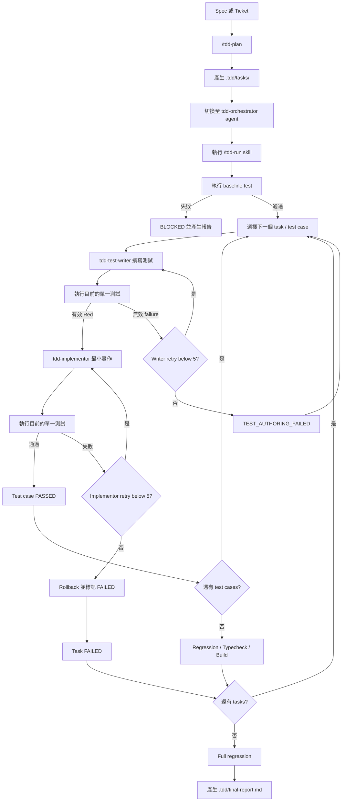

# Multi-Agent TDD Workflow

一套給 OpenCode 使用的 multi-agent TDD workflow。它將需求拆成可驗證的 task，並由不同 agent 分別負責測試與功能實作，讓每個變更都遵循 Red-Green TDD cycle。

## Features

- **真正落實 Red-Green TDD**：每個 test case 都先確認有效的 Red，再進行最小功能實作，避免直接猜測或過度開發。
- **測試與實作由不同 Agent 負責**：`tdd-test-writer` 只寫 unit tests，`tdd-implementor` 只做功能實作，降低修改測試來掩蓋問題的風險。
- **把大型需求拆成可管理的小步驟**：`tdd-plan` 將 spec 或 ticket 拆成有順序、可驗證、具備 dependencies 的 TDD task。
- **可恢復，不怕中斷**：執行狀態保存於 `.tdd/state.yaml`，工作中斷後可以從目前的 task 與 test case 繼續。
- **失敗處理有明確規則**：Test writing 與功能實作各最多五次嘗試；實作失敗時會 rollback，避免不完整的變更污染後續結果。
- **結果透明且容易 review**：`.tdd/final-report.md` 會記錄測試結果、失敗原因、變更檔案、typecheck、build 與 regression 狀態。
- **適用於既有專案**：只需要將 agents 與 skills 合併到既有 `.opencode/`，不要求更換原本的測試框架或開發流程。

## Workflow



### 流程步驟

1. **準備需求**：提供 spec 或 ticket，建議使用 mattpocock `/to-spec`, `/to-tickets` skill。
2. **`/tdd-plan`**：將需求拆成有順序、可驗證的 TDD task files，寫入 `.tdd/tasks/`，定義 public seam 與 test cases。
3. **啟動 `tdd-orchestrator` 並執行 `/tdd-run`**：載入 `.tdd/state.yaml`、驗證 task metadata 與 dependency graph、偵測 test/typecheck/build 命令。
4. **Baseline test**：失敗 → 標記 `BLOCKED`、產生 final report 並停止；通過 → 進入 task 迴圈。
5. 🔁 **迴圈 A — 遍歷每個 task（依 dependency 順序）**
   - 選下一個 task；若 dependency 為 `FAILED`/`BLOCKED`，此 task 標記 `BLOCKED` 並跳過。
   - 🔁 **迴圈 B — 遍歷該 task 的每個 test case（依檔案順序，一次一個）**
     - **Phase 1 / Test Writing (Red)**：設 `WRITING_TEST`，委派 `tdd-test-writer` 寫測試，執行 focused test。
       - 有效 Red → 設 `TEST_RED`，進 Phase 2。
       - Already green 且為有效行為斷言 → 標記 `PASSED`（`already_green`），回到迴圈 B。
       - 無效 failure → 🔁 **迴圈 C — writer retry（最多 5 次）**：重新呼叫 `tdd-test-writer`（同一 test identity）；達 5 次仍失敗 → `FAILED: TEST_AUTHORING_FAILED`，繼續下個 test case。
     - **Phase 2 / Implementation (Green)**：設 `IMPLEMENTING`，委派 `tdd-implementor` 做最小實作，執行 focused test。
       - 通過 → `PASSED`，回到迴圈 B。
       - 失敗 → 🔁 **迴圈 D — implementor retry（最多 5 次）**：重新呼叫 `tdd-implementor`；達 5 次仍失敗 → rollback 該 case 的 production 變更、`FAILED: IMPLEMENTATION_FAILED`、同 task 剩餘 cases 標 `BLOCKED`（rollback 範圍不明確時改標 `BLOCKED` 並停止該 path）。
   - 迴圈 B 結束後：跑 task regression + typecheck + build。全通過 → `PASSED` 並建立 task-level git checkpoint（僅 stage 該 task 變更，不含 `.tdd/`）；任一失敗 → `FAILED`。
   - 回到迴圈 A。
6. **所有 task 處理完**：執行一次 full regression。
7. **產生 `.tdd/final-report.md`**：整體狀態 `COMPLETED`（全通過）或 `FAILED`，交使用者 review。

## Skill 分工

| Skill      | 職責                                                                                                      |
| ---------- | --------------------------------------------------------------------------------------------------------- |
| `tdd-plan` | 讀取 spec 或 ticket，拆解成包含 acceptance criteria 與 test cases 的 TDD task files，並寫入 `.tdd/tasks/` |
| `tdd-run`  | 執行完整 TDD workflow，管理 recovery mode 與流程規則                                                      |

## Agent 分工

| Agent              | 職責                                         |
| ------------------ | -------------------------------------------- |
| `tdd-orchestrator` | 控制流程、執行測試、管理狀態與產生報告       |
| `tdd-test-writer`  | 只撰寫 unit tests                            |
| `tdd-implementor`  | 只修改 production code，完成目前的 test case |

核心規則：一次只處理一個 test case；測試必須透過 public seam 驗證 observable behavior；test writing 與 implementation 各最多五次嘗試。

## 開始使用

### 1. 安裝 workflow

將本 workflow 的 `agents/` 與 `skills/` 內容合併到目標專案的 `.opencode/`。

```bash
git clone https://github.com/gcdeng/opencode-multi-agents-tdd.git /tmp/opencode-multi-agents-tdd

mkdir -p /path/to/your-project/.opencode/agents \
         /path/to/your-project/.opencode/skills

cp -R /tmp/opencode-multi-agents-tdd/agents/. \
      /path/to/your-project/.opencode/agents/

cp -R /tmp/opencode-multi-agents-tdd/skills/. \
      /path/to/your-project/.opencode/skills/
```

### 2. 準備需求

準備一份 spec 或 ticket，內容至少包含使用者可觀察的行為與 acceptance criteria。

### 3. 產生 TDD plan

在目標專案中執行：

```text
/tdd-plan <spec-or-ticket>
```

確認產生的 `.tdd/tasks/TASK-XXX.md` 符合需求後，再繼續執行。

### 4. 執行 workflow

切換至 `tdd-orchestrator` agent，執行：

```text
/tdd-run
```

執行結果會保存於：

```text
.tdd/
├── tasks/          # TDD task 與 test case 定義
├── state.yaml      # 可恢復的執行狀態
└── final-report.md # 測試結果、變更與失敗摘要
```

### 5. 重試失敗項目

修正根因後，只重試失敗或因 implementation failure 被阻擋的 cases：

```text
/tdd-run rerun-failed-only
```

也可以使用 `continue` 繼續現有狀態，或使用 `reset-all` 從整份 plan 重新開始。

## 安全限制

- Task 與 test case 僅依序執行，不平行修改共用檔案。
- `tdd-test-writer` 不得修改 production code；`tdd-implementor` 不得修改測試。
- Orchestrator 不會存取 secrets、`.env`、network，也不會 push 或建立 PR。
- Workflow 完成後請人工 review production diff、test diff 與 `final-report.md`。
