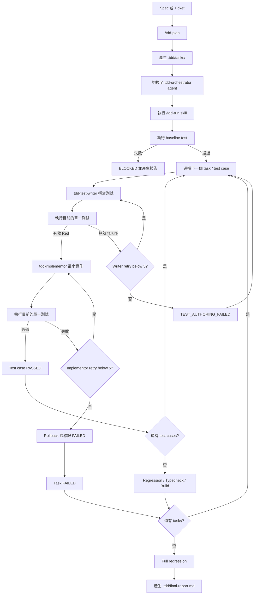

# Multi-Agent TDD Workflow

一套給 OpenCode 使用的 multi-agent TDD workflow。它將需求拆成可驗證的 task，並由不同 agent 分別負責測試與 production code，讓每個變更都遵循 Red-Green TDD cycle。

## Workflow



## Skill 分工

| Skill | 職責 |
| --- | --- |
| `tdd-plan` | 讀取 spec 或 ticket，拆解成包含 acceptance criteria 與 test cases 的 TDD task files，並寫入 `.tdd/tasks/` |
| `tdd-run` | 執行完整 TDD workflow，管理 recovery mode 與流程規則 |

## Agent 分工

| Agent | 職責 |
| --- | --- |
| `tdd-orchestrator` | 控制流程、執行測試、管理狀態與產生報告 |
| `tdd-test-writer` | 只撰寫 unit tests |
| `tdd-implementor` | 只修改 production code，完成目前的 test case |

核心規則：一次只處理一個 test case；測試必須透過 public seam 驗證 observable behavior；test writing 與 implementation 各最多五次嘗試。

## 開始使用

### 1. 安裝 workflow

將本專案的 `.opencode/` 複製到目標專案根目錄：

```bash
cp -R /path/to/ai-tdd-demo/.opencode /path/to/your-project/
```

### 2. 準備需求

準備一份 spec 或 ticket，內容至少包含使用者可觀察的行為與 acceptance criteria。

### 3. 產生 TDD plan

在目標專案中執行：

```text
/tdd-plan <spec-or-ticket>
```

確認產生的 `.tdd/tasks/TASK-XXX.md` 符合需求後，再繼續執行。

### 4. 執行 workflow

切換至 `tdd-orchestrator` agent，執行：

```text
/tdd-run
```

執行結果會保存於：

```text
.tdd/
├── tasks/          # TDD task 與 test case 定義
├── state.yaml      # 可恢復的執行狀態
└── final-report.md # 測試結果、變更與失敗摘要
```

### 5. 重試失敗項目

修正根因後，只重試失敗或因 implementation failure 被阻擋的 cases：

```text
/tdd-run rerun-failed-only
```

也可以使用 `continue` 繼續現有狀態，或使用 `reset-all` 從整份 plan 重新開始。

## 安全限制

- Task 與 test case 僅依序執行，不平行修改共用檔案。
- `tdd-test-writer` 不得修改 production code；`tdd-implementor` 不得修改測試。
- Orchestrator 不會存取 secrets、`.env`、network，也不會 push 或建立 PR。
- Workflow 完成後請人工 review production diff、test diff 與 `final-report.md`。

## 相關文件

- [使用指南](docs/multi-agent-tdd-workflow-guide.md)
- [設計報告](docs/multi-agent-tdd-workflow-design.md)
# opencode-multi-agents-tdd
