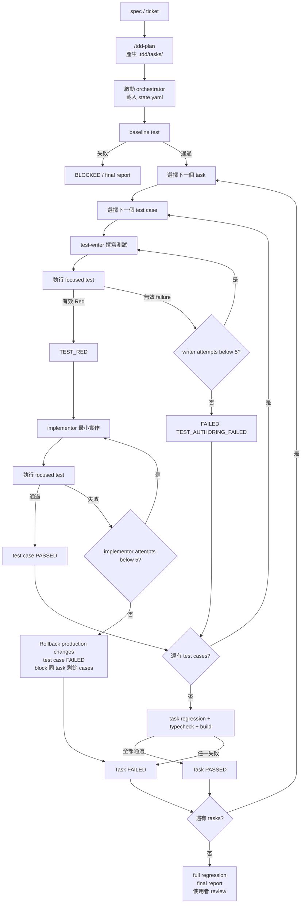

# Multi-Agent TDD Workflow 使用指南

本指南介紹如何使用本專案的 multi-agent TDD workflow，從需求規劃、測試撰寫、最小實作，到 regression 與結果報告。

## 1. 流程目標

這套 workflow 將一個需求拆成多個可獨立驗證的 vertical slice，並讓不同 agent 分別負責測試與 production code：

- `tdd-plan`：讀取 spec 或 ticket，產生可執行的 task 與 test case。
- `tdd-orchestrator`：控制順序、執行測試、管理狀態與產生報告。
- `tdd-test-writer`：只撰寫或修改測試。
- `tdd-implementor`：只修改 production code。

核心原則：

- 一次只處理一個 task 與一個 test case。
- 測試透過已確認的 public seam 驗證 observable behavior。
- implementation 前先確認有效的 Red。
- implementation 只做讓目前測試通過的最小變更。
- 每個階段最多五次嘗試。
- 測試、狀態與報告由不同角色管理，避免 agent 自己修改規則或隱藏失敗。

## 2. 完整流程



## 3. 使用方式

### Step 1: 準備需求

準備一份 spec、ticket，或兩者的內容。需求應盡量描述：

- 使用者可觀察的行為
- acceptance criteria
- 必要的 domain terminology
- 相關的限制與 dependency

範例：

```text
建立付款請求驗證功能：
- 金額必須大於 0
- 幣別必須是支援的幣別
- 無效輸入要回傳 typed validation error
```

### Step 2: 產生 TDD plan

執行：

```text
/tdd-plan <spec-or-ticket>
```

`tdd-plan` 會：

1. 讀取完整需求。
2. 探索 repository 結構與既有測試慣例。
3. 找出測試 framework 與測試命令。
4. 將 spec 拆成小型 vertical tasks。
5. 為每個 task 定義 acceptance criteria、public seam 與 observable behavior。
6. 建立有順序的 test cases。
7. 驗證 task ID、test case ID、dependency 與 task order。
8. 將結果寫入 `.tdd/tasks/TASK-XXX.md`。

這個步驟不會修改 production code，也不會自動啟動 runner。

### Step 3: 檢查 task files

每個 task file 至少應包含：

- YAML front matter：`id`、`title`、`order`、`dependencies`
- Goal
- Acceptance criteria
- Public seam
- Observable behavior
- 有順序的 test cases
- Completion definition

每個 test case 至少應包含：

- `id`
- `status: PENDING`
- `max_attempts: 5`
- `given`
- `when`
- `then`
- 預期測試檔案位置

本 workflow 只允許 unit test，task 不應規劃 integration 或 e2e test case。Task files 依 `tdd-plan` 的 `references/task-template.md` 產生，並與 `tdd-run` 的 final report 欄位對齊：`id` + `title` 對應報告的 task 標題、`Public Seam` 對應 Task Results、test case 的 `id`/`status`/`max_attempts` 對應報告表格欄位。

### Step 4: 啟動 orchestrator

在確認 task files 已存在後，啟動 `tdd-orchestrator`，並執行 `tdd-run` skill 定義的流程。

啟動時會：

- 載入 `.tdd/tasks/`
- 載入或建立 `.tdd/state.yaml`
- 驗證 task metadata 與 dependency graph
- 偵測測試、focused test、typecheck 與 build 命令
- 執行 baseline test

如果 baseline test 失敗，workflow 不會把問題歸因給目前 task，而是標記為 `BLOCKED` 並停止。

### 失敗後如何繼續

如果 final report 有 `FAILED` 或 `BLOCKED` test case，不要直接期待一般 resume 會重試它們；一般 resume 會依 state 跳過已失敗項目。先依 final report 修正根因，再明確指定 recovery mode：

```text
/tdd-run rerun-failed-only
```

也可以直接這樣 prompt orchestrator：

```text
請讀取 `.tdd/final-report.md`，針對其中的 FAILED/BLOCKED test cases 修正根因，完成後以 `rerun-failed-only` 模式重試；不要重跑已 PASSED 的 cases。
```

可用的 recovery mode：

- `continue`：依目前 `.tdd/state.yaml` 繼續；`PASSED`、`FAILED`、`BLOCKED` 維持原狀。
- `rerun-failed-only`：重試 `FAILED` test cases，以及同一 task 中因 implementation failure 而被標記 `BLOCKED` 的 cases；已通過的 cases 不重跑。
- `reset-all`：保留 task files，但重建 runtime state，從整份計畫重新執行。

在 `rerun-failed-only` 模式中，工具會將要重試的 cases 設為 `PENDING`、清除 `failure_reason`，並將兩個 attempts counter 歸零。依賴失敗而被 block 的 task，會等 dependency 通過後才重新變成可執行；工具不會默默重置 state。

### Step 5: 逐一執行 test case

每個 test case 依序經過以下階段：

1. orchestrator 將狀態設為 `WRITING_TEST`。
2. `tdd-test-writer` 撰寫一個測試。
3. orchestrator 執行 focused test。
4. 如果是有效 production-behavior failure，狀態變成 `TEST_RED`。
5. orchestrator 將狀態設為 `IMPLEMENTING`，並呼叫 `tdd-implementor` 修改最少的 production code。
6. orchestrator 再次執行 focused test。
7. 通過後將 test case 標記為 `PASSED`。

test-writer retry 必須修改同一個 test identity，不得留下失效或重複的測試。

## 4. Red 與 Green 判斷

### 有效 Red

有效 Red 必須同時符合：

- 測試可以正常執行。
- failure 來自尚未實作的 production behavior。
- 測試驗證 acceptance criteria。
- failure 與目前 task 有關。

以下不是有效 Red：

- syntax error
- import error
- test environment error
- unrelated test failure
- 空 assertion 或 tautological test

### Already Green

後面的 test case 可能因為前一個 slice 已經實作相同行為而直接通過。這不一定是測試錯誤。

如果測試確實驗證行為，且不是空 assertion 或 tautological test，就標記：

```text
status: PASSED
result: already_green
```

不要為了製造 Red 而刻意削弱或改寫有效測試。

## 5. Retry 與 Rollback

每個 test case 有兩組獨立上限：

| 階段 | 上限 | 失敗結果 |
| --- | ---: | --- |
| test writing / Red confirmation | 5 次 | `TEST_AUTHORING_FAILED` |
| implementation / Green confirmation | 5 次 | `IMPLEMENTATION_FAILED` |

### Test authoring failure

第五次仍無法產生有效 Red 時：

- test case 標記為 `FAILED`
- 記錄 `TEST_AUTHORING_FAILED`
- 保留 failure 摘要在 final report
- 可以繼續同一 task 的下一個 test case

### Implementation failure

第五次 implementation 仍失敗時：

- rollback 該 test case 產生的 production changes
- test case 標記為 `FAILED`
- 記錄 `IMPLEMENTATION_FAILED`
- 同一 task 剩餘 test cases 標記為 `BLOCKED`
- independent tasks 可以繼續

Rollback 不使用 `git reset --hard`。如果無法安全判斷 rollback 範圍，test case 與 task 應標記 `BLOCKED`，停止該 workflow path，不要自行猜測。

## 6. Task Dependencies

task 會依照 `dependencies` 執行：

- dependency 全部 `PASSED`：task 可以執行。
- dependency `FAILED`：dependent task 標記為 `BLOCKED`。
- dependency `BLOCKED`：dependent task 也標記為 `BLOCKED`。
- 沒有 dependency 關係的 task 可以繼續執行。

一個 task 的所有 runnable test cases 完成後，執行：

1. task regression
2. typecheck
3. build

只有所有 test cases 與 checks 都通過，task 才能標記為 `PASSED`。

Task 標記為 `PASSED` 後，若 repository 是 git worktree，orchestrator 會在開始下一個 task 前建立 task-level checkpoint。checkpoint 只包含該 task 的 production 與 test 變更，不包含 `.tdd/` 或其他既有變更；commit hash 或失敗原因會寫入 final report。非 git worktree 會跳過 checkpoint。checkpoint 失敗不會把 task 改為 `FAILED`，也不會透過擴大 stage 範圍或 bypass hooks 重試。

所有 runnable tasks 完成後，最後執行一次 full regression。任何 task、test case 或 final check 失敗，整個 workflow 最終狀態為 `FAILED`。

## 7. Artifact 說明

### `.tdd/tasks/`

每個 task 一份 Markdown 文件。這是 task specification 與 test case 的 canonical source，依 `tdd-plan` 的 `references/task-template.md` 產生。front matter 包含 `id`、`title`、`order`、`dependencies`。

```text
.tdd/tasks/
├── TASK-001.md
└── TASK-002.md
```

### `.tdd/state.yaml`

state 只保存恢復執行所需的最小資訊：

```yaml
version: 2
workflow_status: RUNNING
current_task: TASK-001
current_test_case: TC-002

tasks:
  TASK-001:
    status: IN_PROGRESS
    test_cases:
      TC-001:
        status: PASSED
        writer_attempts: 1
        implementor_attempts: 1
      TC-002:
        status: TEST_RED
        writer_attempts: 1
        implementor_attempts: 0
```

`state.yaml` 不保存完整 command output。詳細 command 結果、failure、changed files 與 rollback 結果放在 final report。

Task-level git checkpoint 不寫入 `state.yaml`；commit hash 或 checkpoint 失敗原因記錄在 final report。

Test case status 表示目前要恢復的階段：

| Status | 恢復動作 |
| --- | --- |
| `PENDING` | 開始 test-writer |
| `WRITING_TEST` | 重新執行 focused test，必要時 retry test-writer |
| `TEST_RED` | 呼叫 implementor |
| `IMPLEMENTING` | 重新執行 focused test，再決定是否 retry |
| `PASSED` | 跳過 |
| `FAILED` | 跳過並保留在 report |
| `BLOCKED` | 跳過，等待 dependency 或 task 修正 |

### `.tdd/final-report.md`

final report 是給使用者 review 的結果文件，包含：

- workflow status
- task 與 test case 統計
- 每個 task 的狀態、public seam、test case 表格與 git checkpoint
- 實際變更檔案
- baseline、focused、regression、typecheck、build 結果
- failure reason 與最後錯誤摘要
- rollback 狀態
- task-level git checkpoint 的 commit hash 或跳過/失敗原因
- known limitations

## 8. Agent 權限

### `tdd-orchestrator`

可以：

- 讀取 workflow 文件
- 執行測試、typecheck 與 build
- 執行 git status、git add 與 git commit，管理 task-level checkpoint
- 呼叫指定的兩個 subagent
- 寫入 `.tdd/state.yaml`
- 寫入 `.tdd/final-report.md`

不能直接修改 production code 或 test files。

Task 通過後，只 stage 該 task 的 production 與 test 變更；不得 stage `.tdd/`、無關的既有變更，或透過 bypass hooks 重新 commit。非 git worktree 時停用 checkpoint 並繼續 workflow。

orchestrator 也必須遵守以下安全限制：

- 不存取 network、secrets、credentials 或 `.env`，除非使用者明確授權目前 task 的狹義例外。
- 不執行 destructive commands、不使用 `git reset --hard`、不 push、不建立 pull request。
- rollback 範圍不明確時標記 `BLOCKED`，不得自行猜測。

### `tdd-test-writer`

只負責測試：

- 不執行測試命令
- 不修改 production code
- 不修改 task files 或 workflow state
- retry 時更新同一個測試

### `tdd-implementor`

只負責 production code：

- 不執行測試命令
- 不修改測試檔案
- 不修改 task files 或 workflow state
- 只處理目前 test case 要求的行為

## 9. 常見問題

### 測試一開始就通過，是否一定是錯誤？

不一定。先確認測試是否真的驗證 acceptance criteria。如果有效，就記錄 `already_green`；只有測試本身無效時才重新撰寫。

### 為什麼 implementor 不能修改測試？

避免 production failure 被修改 assertion 掩蓋，也讓測試與實作由不同 agent 產生，降低自我驗證偏差。

### 為什麼 implementation failure 後要 rollback？

避免 partial implementation 污染後續 test cases，使後續結果無法正確歸因。

### 可以平行執行 task 嗎？

不可以。所有 task 與 test case 都是 sequential execution，以避免共用檔案造成結果互相影響。

### workflow 中斷後怎麼繼續？

重新啟動 orchestrator，讀取 `.tdd/state.yaml`，依照 `workflow_status`、目前 task、目前 test case 與 test case status 繼續。若狀態與檔案結果無法安全判斷，應停止並要求人工處理。

如果是失敗後要重試，使用 `/tdd-run rerun-failed-only`；不要手動刪除 state 或直接假設 FAILED case 會自動重跑。

## 10. 建議的使用檢查表

啟動前：

- spec 或 ticket 可讀取
- `.tdd/tasks/` 存在
- task IDs 與 test case IDs 唯一
- dependencies 指向存在的 task
- 測試命令可以被偵測

如果 repository 是 git worktree，啟動時也會檢查 contribution guidance 與近期 commit history，以沿用既有的 commit message convention。

執行中：

- 一次只有一個 active task/test case
- test-writer 與 implementor 沒有平行執行
- Red failure 是 production behavior failure
- retry 更新同一個 test identity
- 每次狀態轉移都更新 `.tdd/state.yaml`

完成後：

- task regression 通過
- typecheck 通過
- build 通過
- full regression 通過
- `.tdd/final-report.md` 已產生
- 使用者已檢查 production diff 與 test diff
